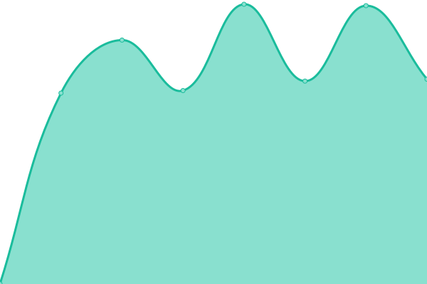

# [📈 Live Status](https://demo.upptime.js.org): <!--live status--> **🟧 Partial outage**

This repository contains the open-source uptime monitor and status page for [CodeGuardian-Official](https://demo.upptime.js.org), powered by [Upptime](https://github.com/upptime/upptime).

With [Upptime](https://upptime.js.org), you can get your own unlimited and free uptime monitor and status page, powered entirely by a GitHub repository. We use [Issues](https://github.com/CodeGuardian-Official/status/issues) as incident reports, [Actions](https://github.com/CodeGuardian-Official/status/actions) as uptime monitors, and [Pages](https://demo.upptime.js.org) for the status page.

<!--start: status pages-->
<!-- This summary is generated by Upptime (https://github.com/upptime/upptime) -->
<!-- Do not edit this manually, your changes will be overwritten -->
<!-- prettier-ignore -->
| URL | Status | History | Response Time | Uptime |
| --- | ------ | ------- | ------------- | ------ |
|  [Scoppiato](https://www.scoppiato.it) | 🟩 Up | [scoppiato.yml](https://github.com/CodeGuardian-Official/status/commits/HEAD/history/scoppiato.yml) | 

 1693ms
     
 | 

<a href="https://status.scoppiato.it/history/scoppiato">99.22%</a>
    

|  [Notepaddo](https://notepaddo.scoppiato.it) | 🟩 Up | [notepaddo.yml](https://github.com/CodeGuardian-Official/status/commits/HEAD/history/notepaddo.yml) | 

 739ms
     
 | 

<a href="https://status.scoppiato.it/history/notepaddo">99.22%</a>
    

|  [BeatNova](https://beatnova.scoppiato.it) | 🟩 Up | [beat-nova.yml](https://github.com/CodeGuardian-Official/status/commits/HEAD/history/beat-nova.yml) | 

 959ms
     
 | 

<a href="https://status.scoppiato.it/history/beat-nova">98.93%</a>
    

|  [Pterodacyl Scoppiato](https://panel.scoppiato.it) | 🟥 Down | [pterodacyl-scoppiato.yml](https://github.com/CodeGuardian-Official/status/commits/HEAD/history/pterodacyl-scoppiato.yml) | 

 1787ms
     
 | 

<a href="https://status.scoppiato.it/history/pterodacyl-scoppiato">79.00%</a>
    

<!--end: status pages-->

[**Visit our status website →**](https://demo.upptime.js.org)

## 📄 License

- Powered by: [Upptime](https://github.com/upptime/upptime)
- Code: [MIT](./LICENSE) © [Anand Chowdhary](https://anandchowdhary.com), supported by [Pabio](https://pabio.com)
- Data in the `./history` directory: [Open Database License](https://opendatacommons.org/licenses/odbl/1-0/)
